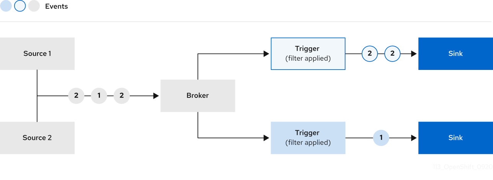
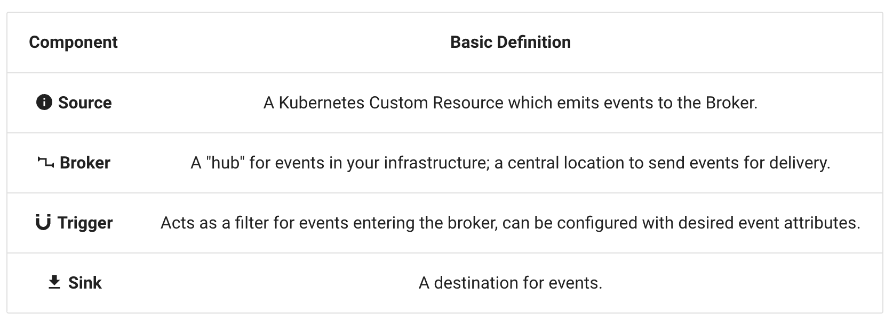

## Introducing the Knative Eventing
With Knative Serving, we have a powerful tool which can take our containerized code and deploy it with relative ease.
With Knative Eventing, you gain a few new super powers 🚀 that allow you to build Event-Driven Applications.
> ❓ **What are Event Driven Applications?**
> Event-driven applications are designed to detect events as they occur, and then deal with them using some
> event-handling procedure. Producing and consuming events with an "event-handling procedure" is precisely what
> Knative Eventing enables.
> Want to find out more about Event-Driven Architecture and Knative Eventing? Check out this CNCF Session
> aptly named "[Event-driven architecture with Knative events](https://www.cncf.io/online-programs/event-driven-architecture-with-knative-events/)"

Knative Eventing acts as the "glue" between the disparate parts of your architecture and allows you to easily
communicate between those parts in a fault-tolerant way.

Knative Eventing implementations can range from simplistic to extremely complex. 
For now, you'll start with simplistic and learn about the most basic components of 
Knative Eventing: **Sources, Brokers, Triggers**, and **Sinks**.


## Sources, Brokers, Triggers, Sinks, oh my!
For the purposes of this tutorial, let's keep it simple. You will focus on four powerful 
Eventing components: **Source, Trigger, Broker**, and **Sink**.

Let's take a look at how these components interact:



> ✏️ **A note on Sources and Sinks**
> A Knative Service can act as both a Source and a Sink for events, and for good reason. 
> You may want to consume events from the Broker and send modified events back to the Broker, 
> as you would in any pipeline use-case. 

### CloudEvents

Knative Eventing uses [CloudEvents](https://github.com/cloudevents/spec/blob/v1.0.1/primer.md) to send information back and forth between your Services and these components.

> ❓ **What are CloudEvents?**
> For our purposes, the only thing you need to know about CloudEvents are:
> 1. CloudEvents can carry some attributes (like id, Source, type, etc) as well as data payloads (JSON, plaintext, reference to data that lives elsewhere, etc).
> 2. CloudEvents can be "emitted" by almost anything and can be transported to anywhere in your deployment.
> 3. CloudEvents follow the [CloudEvents 1.0 Specification](https://github.com/cloudevents/spec), with required and optional attributes.
> To find out more about CloudEvents, check out the [CloudEvents website](https://cloudevents.io/)! 

### Examining the Broker
As part of this tutorial, an In-Memory Broker should already be installed in your Cluster. 
Check to see that it is installed by running the command:

`kn broker list`{{execute}}

✅ **Expected output:**
```sh
NAME             URL                                                                                AGE   CONDITIONS   READY   REASON
example-broker   http://broker-ingress.knative-eventing.svc.cluster.local/default/example-broker     5m    5 OK / 5    True
```
❌ **Unexpected output:**
If you get this output
```sh
NAME             URL   AGE   CONDITIONS   READY       REASON
example-broker         35s   0 OK / 0     <unknown>   <unknown>
```
If you get this output run the following commands to recreate the broker. If you got the
**Expected output** there is no need to run these commands.
```sh
kn broker delete example-broker
```{{execute}}
```sh
kn broker create example-broker
```{{execute}}

And check the status again

`kn broker list`{{execute}}


> ⚠️ **Note**
> In-Memory Brokers are for development use only and must not be used in a production deployment.
 
> ❓ **Are there any other components of Knative Eventing?**
> Though it is out of scope for this tutorial, Knative Eventing has many components which 
> can be used in many ways to suit your needs.
> If you want to find out more about the different components of Knative Eventing, such as Channels, 
> Sequences and Parallel flows, check out the [Knative Eventing documentation](https://knative.dev/docs/eventing/).

**Next, you'll take a look at a simple implementation** of Sources, Brokers, Triggers and Sinks using an app called the CloudEvents Player.
